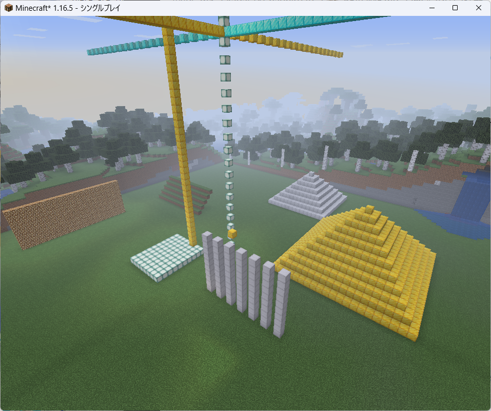

# マイクラ課題

1. 金ブロックをひとつ置く
（x=5, y=70, z=5）
2. 柱を建てる
（x=5, z=10に、y=63から高さ10で。）
3. 柱を並べて建てる
（x=5, z=10から間隔2で7本。y=63から高さ10で。）
4. 並んだ柱を消す
（空気を置くと消える。）
5. 柱をz方向に寝かせる
（地上y=63に、x=0, z=5から10ブロックで。）
6. 床を作る
（柱をx方向に8本、地上に寝かせる。x=10,z=5から。）
7. 壁、階段を作る
8. ピラミッドを作る
9. 地面を平らにする
（yが63以上なら全部消す、yが62なら土になる、yが61以下なら全部石にする）
10. 地面を平らにして金閣寺のパチモンを作る
(変数XとZで、好きなところに建築することができる。大きさの変更はできない)
9以降がオリジナル(自分で作成したやつ)

[](./images/kadai.png)

```minecraft
/tp 0 80 0
/time set 0
/weather clear
```

```bash
cd itkids_m5/kadai_00_NT_naohiro2g
ls -la
python hello.py
python axis_flat.py
python kadai_01.py
```

[](2023-08-15_17.09.26.png)

```minecraft
/tp 0 100 0
/time set day
/weather clear
```

```bash
cd itkids_m5/kadai_10_DT_brightterra
ls -la
python original_10.py
```

夜景の場合

[](2023-08-19_12.55.10.png)

```minecraft
/tp 0 100 0
/time set night
/weather clear
```

```bash
cd itkids_m5/kadai_10_DT_brightterra
ls -la
python original_10.py
```

ジャングルの場合

[](2023-08-19_12.40.50.png)

```minecraft
/tp 3189 100 -1419
/time set day
/weather clear
```

```bash
cd itkids_m5/kadai_10_DT_brightterra
ls -la
python original_10.py
```